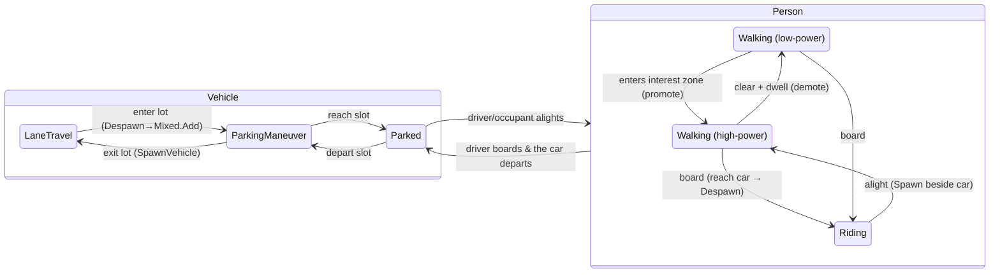

# PEDESTRIAN-DESIGN.md — the HOW of the pedestrian subsystem

**Status: design for review. No code yet.** Companion to `PEDESTRIAN-OVERVIEW.md` (the WHAT — read it
first) and `PEDESTRIAN-POC-PLAN.md` (the experiments that de-risk this). This document is the reasoning:
the architecture, the mechanisms, and — the load-bearing part — the *principles* that must hold for the
subsystem to be performant, believable, interactive, evac-capable, and network-distributable at the
10k-high / 100k-total / 10k-cars scale.

This is on the **live-reactivity axis** (`DESIGN.md`): validated behaviorally, never by golden FCD. The
parity lane core is untouched (hash `909605E965BFFE59`) and every mechanism here is inert when no
pedestrians are present.

---

## 0. Principles first (the things that must not be compromised)

Everything below is in service of six principles. When a later choice conflicts with one of these, the
principle wins.

1. **Reuse the continuous crowd, don't re-lane pedestrians.** The operational hard part (reciprocal
   collision avoidance, deterministic, SoA, cache-friendly) is already solved by `OrcaCrowd`. We add
   *navigation* and *coordination* on top; we do not rebuild motion, and we do not adopt SUMO's lane-like
   striping.
2. **One state machine, many regimes.** Cars entering a car park, drivers becoming pedestrians, ambient
   walkers waking up into full agents — these are *the same event*: a deferred structural transition
   through the command buffer that emits a network lifecycle event. Build it once.
3. **LOD is two axes, not one.** *Compute* fidelity (low/high power) and *network* fidelity (per-channel
   area-of-interest) are independent. Conflating them wastes either CPU or bandwidth. The whole scale
   argument rests on keeping them separate.
4. **Cheap must be deterministic-from-its-input.** A low-power pedestrian is only cheap on the wire if the
   IG can reproduce it from data sent once (its path). That forbids neighbor-dependent behavior in
   low-power mode — which is exactly why low-power agents must be *promotable* the instant they matter.
5. **Determinism is non-negotiable, parity is not required.** No `System.Random`; frozen-state reads;
   fixed tie-breaks; command-buffer ordering. Single-thread == parallel, run-to-run identical, and (for
   low-power path agents) server == IG. But we are free of SUMO's byte-exact bar — behavioral/property
   tests are the validation.
6. **Pedestrians run in a separate engine; the parity lane core stays inert.** Pedestrian motion is the
   `OrcaCrowd`/`Sim.Pedestrians` solver — a *wholly different engine* from the lane car-following core. A
   pedestrian is never stepped through the lane engine's `PlanMovements`/Krauss path; the two worlds meet
   **only** through the neutral `WorldDisc`/`ICrowdFootprintSource` seam (cars see peds as discs, peds see
   cars as discs). Likewise, pedestrian **network** geometry (sidewalks, crossings, walkingAreas) is read
   by a *separate* ped-network ingest, not the parity `NetworkParser` (which today does not parse lane
   `allow`/`vClass` at all and must not be perturbed). Consequence, and the point of this principle:
   **developing pedestrians cannot move SUMO parity** — no pedestrian code path executes on a parity
   scenario, and the determinism hash `909605E965BFFE59` is structurally out of reach of this work.

---

## 1. Architecture overview — a layered agent

Every mover (pedestrian, and by generalization every vehicle) is modeled in three motion layers:

| Layer | Question it answers | Status |
|---|---|---|
| **Strategic** | Which walkable areas take me from origin to destination? | NEW (routing over walkable space) |
| **Tactical** | Given my path, what direction do I *want* to move right now? | NEW (portal/funnel → preferred velocity) |
| **Operational** | Given what I want and everyone around me, what velocity do I actually take? | BUILT — `OrcaCrowd.Step` (`src/Sim.Core/Orca/OrcaCrowd.cs:226`) |

The operational layer already exists and is deterministic and parallel-ready. The strategic and tactical
layers are the primary gap. The tactical layer's output is precisely the `pref` (preferred velocity)
input the ORCA solver already consumes (`OrcaCrowd.Plan`, `OrcaCrowd.cs:293`) — so the seam between "what
we build" and "what exists" is clean and already defined.

### The two LOD axes (Principle 3)

- **Sim-LOD (compute) — global, server-decided.** A pedestrian is either **low-power** (a deterministic
  path/flow-field follower: O(1) per step, no neighbor queries, no reactive avoidance) or **high-power**
  (a full `OrcaCrowd` agent: routing + reciprocal avoidance). This decides *how much CPU* the agent costs.
- **Net-LOD (bandwidth) — per-IG-channel.** Independently, each IG channel only needs detail for the
  pedestrians in *its* camera's area of interest. This decides *how many bytes* the agent costs *that
  channel*.

These are orthogonal. A pedestrian near an incident is high-power (must react) even if no camera sees it;
a pedestrian strolling a distant sidewalk is low-power but, if a channel's camera points at it, that
channel still renders it — from its path, sent once, for almost no bytes. The 10k-high / 100k-total
budget is only reachable because these two are decoupled: **CPU scales with the high-power set (~10k),
bytes scale with each camera's view, and the 90k ambient bulk is cheap on both axes.**

---

## 2. The unified regime / lifecycle state machine (the spine)

This is the single most important structural idea (Principle 2). Requirements 4 (evac) and 6 (parking,
boarding) are *not* separate features — they are transitions of one state machine that already partly
exists in `Sim.Evac`.

### Regimes

**Vehicle regimes:**
- `LaneTravel` — the SUMO-parity lane engine (the default; unchanged).
- `ParkingManeuver` — free-space low-speed maneuvering in a `MixedTrafficCrowd`
  (`src/Sim.Core/Mixed/MixedTrafficCrowd.cs`): shaped non-holonomic (kinematic-bicycle) steering, box
  obstacles, soft priority. This is where in-lot driving lives.
- `Parked` — stationary; left behind as a static `WorldDisc`/box footprint that peds and cars avoid.

**Person regimes:**
- `Walking` — an `OrcaCrowd` agent, itself either low-power or high-power (the sim-LOD sub-state, §5).
- `Riding` — despawned from the crowd; conceptually inside a vehicle. Not simulated as a ped.

### Transitions and their mechanics

Every transition is a **deferred structural mutation** recorded on the thread-safe `CommandBuffer`
(`src/Sim.Core/CommandBuffer.cs`) and applied in record order at a phase barrier, and every transition
emits a **network lifecycle event** on the keyed, transient-local topic (`DdsVehicleLifecycle`,
`src/Sim.Replication.Dds/DdsTopics.cs`). The mechanics reuse existing engine API:

- **`LaneTravel → ParkingManeuver`** (car enters a lot): `Engine.Despawn(handle)` removes it from the
  lane world, then `MixedTrafficCrowd.Add(...)` inserts it as a free-space maneuvering agent with a goal
  (its target slot). *This is exactly `Sim.Evac`'s `EnterOrcaPush` (`src/Sim.Evac/EvacDirector.cs:343`),
  already written and tested.*
- **`ParkingManeuver → LaneTravel`** (car leaves a lot): remove from the `MixedTrafficCrowd`, then
  `Engine.SpawnVehicle(type, routeEdges, departPos, departSpeed, departLane)`
  (`src/Sim.Core/Engine.cs:1699`) re-inserts it onto the exit lane at a chosen arc-length and speed. Slot
  recycling in `SpawnVehicle` absorbs the churn. *The re-insertion API exists; this direction is the new
  bit and is a POC target.*
- **`* → Parked`**: stop the maneuvering agent; register a static `WorldDisc`/box (the `_abandoned`
  pattern, `EvacDirector` `FeedVehicleDiscsToPeds`).
- **`Walking → Riding`** (board): when a ped reaches its target car's footprint, remove it from the
  `OrcaCrowd` (a despawn lifecycle event → the IG shows it *vanish* next to the car). If it is the driver,
  the car may then transition `Parked → ParkingManeuver → LaneTravel` and drive away.
- **`Riding → Walking`** (alight): spawn a ped in the `OrcaCrowd` at an offset from a parked car's box (a
  spawn lifecycle event → the IG shows it *appear* beside the car), with a walking destination.
- **Sim-LOD `low ↔ high power`** and **DR-model `PathArc ↔ FreeKinematic`**: §5 and §7. Also
  command-buffer + lifecycle-event transitions.

### Why the state machine matters

- **Evac is not special.** `Sim.Evac`'s lane→push→pedestrian cascade *is* the first instance of this
  machine. Panic-evac becomes: "force a high-power promotion + set destination = safe zone + apply the
  flee param override." No separate code path.
- **Determinism (Principle 5).** Each transition is triggered by a pure function of frozen start-of-step
  state, decided with a fixed tie-break (e.g. lowest entity index), and flushed in record order. So the
  set and order of transitions is independent of thread scheduling — single-thread == parallel, and
  run-to-run identical. The command buffer already guarantees order-independent flush because each command
  targets a distinct entity (`CommandBuffer.cs`).
- **Networking falls out for free.** Because every transition is already a lifecycle event, the IG's view
  of "a ped walked to a car and got in" is just the despawn event it already knows how to process. No new
  network concept — only new event *kinds*.

---

## 3. Operational layer — the crowd solver (BUILT, with three gaps)

Pedestrians are `OrcaCrowd` agents, reused wholesale: `Add(pos, radius, maxSpeed, goal)`
(`OrcaCrowd.cs:152`), `SetGoal`, `Step(dt)` (plan/execute double buffer, deterministic, `:226`),
`AddObstacle(vertices)` closed-polyline walls (`:177`), `SetExternalObstacles(WorldDisc[])` moving
external discs (`:430`), `QueryNear` (expose peds to the lane engine, `:444`), `UseSpatialHash` (`:108`),
`MaxNeighbours`, `RemoveOnArrival`, `SymmetryBreak`. Because the store is value-type contiguous SoA, it
does **not** suffer the lane core's random-reference memory-bandwidth wall (the documented ~3.5× ceiling,
`docs/PERF-HANDOVER.md` §5) — it is the right shape to scale.

Three gaps must be closed for the requirements:

**(a) Oriented-box obstacles.** Today `OrcaCrowd` has disc external obstacles + closed-polyline walls, but
not oriented boxes. A car parked across a sidewalk (Req 3) and the parked cars in a lot (Req 6) are boxes.
Two options: add oriented-box obstacle support to `OrcaCrowd`, or route box-heavy cases through
`MixedTrafficCrowd`, which already has `AddWall`/`AddBlock` oriented boxes and a Minkowski-sum shaped-VO
solver (`ShapedVoSolver`, `docs/MIXED-WALL-CONTAINMENT.md`). **Recommendation:** add box obstacles to the
pedestrian path (the math is already proven in `MixedTrafficCrowd` and can be shared via `HalfPlaneLp`),
so pedestrians and maneuvering cars can share one obstacle world in a parking lot without a second solver.

**(b) A static-obstacle spatial index.** The obstacle/wall scan in `OrcaCrowd.Plan` (`:401`) is O(n)
brute-force — fine for a navmesh boundary loop, untenable for a city of buildings or a lot full of parked
cars. Build a spatial index for *static* obstacles mirroring the agent spatial hash (`RebuildGrid`,
`:520`). This is a hard prerequisite for Req 6 at scale.

**(c) Parallelize `Step`.** `OrcaCrowd.Step` is serial today, yet embarrassingly parallel by construction
(plan reads frozen state, writes only ego's `_newVelocity`). Parallelize with the engine's `Parallel.For`
+ size-gating pattern. Heed the perf lesson (`docs/PERF-HANDOVER.md` #1): memory-light per-agent work
loses to per-item dispatch overhead, so **chunk over contiguous SoA ranges**, not per-agent. Region
decomposition (the `ComputeLaneRegions` analog, `docs/DOMAIN-DECOMP.md`) is a later lever once the flat
parallel `Step` plateaus.

**(d) Efficient agent add/remove for LOD churn.** *(Verified in POC-3.)* `OrcaCrowd` has no public
agent-removal — only `RemoveOnArrival` deactivation — so a `PedLodManager` that promotes/demotes agents
every step cannot add/remove them in place. POC-3 worked around this by **rebuilding the high-power crowd
on any membership-change step** (carrying each surviving agent's position + velocity), which is correct and
deterministic but O(high-power count) per change. At the ~10k high-power target with a moving interest
source churning membership continuously, that rebuild is a real cost. Production needs either a genuine
`Add`/`Remove` (free-list + generation, like the lane engine's slot recycling) on the crowd store, or a
stable-slot crowd where demotion just deactivates. This is a POC-7 concern; the POC-3 rebuild is the
interim.

**Believability (Req 2).** Pure ORCA is inherently laneless; emergent bidirectional lane-formation is
*realistic*, not a defect. Do **not** pre-build a density model. Measure a dense corridor + a bottleneck
first (POC-4); add a density/pressure term (a speed–density fundamental-diagram relation on `maxSpeed`)
*only* if the measured flow is visibly too orderly. Premature crowd-physics is the classic over-build.

---

## 4. Navigation — strategic + tactical (behind interfaces; DotRecast for dev)

Navigation is the primary gap and must sit behind interfaces, because the owner has a **production
navmesh** to plug in later (Principle: no double-build). Three seams (NEW):

- **`IWalkableSpace`** — the walkable-geometry provider (polygons/navmesh + connectivity).
- **`IPedNavigation`** — strategic: `origin, destination → ordered portal/waypoint path` over the walkable
  space (shortest-path / A*).
- **`ILocalSteering`** — tactical: `position, path, dt → preferred velocity` (the ORCA `pref` input).

Two dev providers behind these seams (two providers also *prove* the seam is real, not a shim around one
implementation):

1. **DotRecast** (MIT-licensed C# port of Recast/Detour — decision D4): true open-space navmesh for
   plazas, malls, and parking lots, with funnel/string-pull path smoothing built in.
2. **SUMO-geometry bake**: build walkable polygons directly from the SUMO pedestrian network we already
   ingest (`Sim.Ingest`) — sidewalk lanes (`allow="pedestrian"`), pedestrian **crossings**, and
   **walkingAreas** from `net.xml`. This makes street-sidewalk routing free and keeps the door open to
   consuming SUMO ped demand later.

### High-power tactical steering

Funnel/string-pull along the portal path to a local steering target, normalized to a `pref` velocity at
the agent's `maxSpeed`, fed into `OrcaCrowd`. Crossing portals are *gated* (§6): the steering target is
held at the portal until the gate opens. If the next portal is fully blocked (an obstacle occludes it),
the strategic layer reroutes (`IPedNavigation` re-query) — this is Req 3's "route around a blocker."

### Low-power motion (the cheap 90k)

A **deterministic path-follower with a speed profile**: the agent's position at time *t* is a pure
function of `(path, startTime, speedProfile)`, with **no neighbor-dependent avoidance** (Principle 4).
This determinism is exactly what lets the IG reproduce the agent from its path alone (§7, `PathArc`).
Optionally, a **static shared flow-field** variant behind the same `ILocalSteering` for anonymous ambient
"crowd fields" (many walkers → few destinations, e.g. a plaza drift) where individual identity does not
matter — a flow-field is per-cell-static, so it too is IG-reproducible.

The constraint this imposes is deliberate and is the crux of the scale story: **low-power agents cannot
react to their neighbors** (that would be non-deterministic to the IG), so they are only acceptable where
nothing needs reacting to. The moment something *does* (§5), they promote.

---

## 5. Sim-LOD — low/high power and promotion/demotion

**Low-power** = §4 deterministic follower: O(1)/step, no neighbor query, no ORCA. **High-power** = full
`OrcaCrowd` agent with routing + reactive avoidance. The population split targets ~10k high / ~90k low.

**The high-power set is defined by a dynamic set of "interest sources", not a fixed trigger list.** An
*interest source* is a volume (radius/region) that promotes any low-power ped inside it. Sources are:
- **Movable, entity-attached** — the common case: an external/player-controlled entity (an avatar, an
  external car, or a pedestrian who just got out of a car) carries its own high-power bubble as it moves
  through the city, so the crowd around it becomes interactive wherever it goes (Use case 1). An IG
  camera is the same shape of source (Use case 3): a moving frustum/region that promotes what it looks
  at, so the crowd renders as believably-interacting under inspection rather than path-following robots.
- **Static, scripted** — a designated area of interest known up front (Use case 2).
- **Intrinsic** — a crosswalk with approaching traffic, a parking lot, a dense bottleneck, or an evac
  incident promotes peds in its vicinity regardless of any camera/avatar.

There can be **several active interest sources at once, each moving independently** (Use case 4). A ped is
high-power iff it lies within the promotion volume of *any* active source. Concretely this is an
**interest field**: a small, per-step set of source volumes (typically tens, not thousands), queried per
low-power ped via the same spatial hash the crowd already uses — cheap because sources are few. Promotion
is a pure function of frozen state (source positions are start-of-step), with a fixed tie-break, so it is
deterministic and thread-order-independent. Note the two roles a **camera** plays are still orthogonal
(Principle 3): as an *interest source* it drives **sim-LOD** (promote to interactive compute); as a
**net-LOD** frustum it drives *which* high-power peds that channel receives. A camera can do both, but the
two decisions are made independently.

**Demotion (high → low)** — outside every active interest source's (larger, hysteretic) volume for a
**dwell time**, *and* the agent can be re-projected onto a deterministic path at its nearest arc-length.

**Hysteresis (no flapping):** promotion radius > demotion radius, plus a minimum dwell in each state.
Thresholds are on frozen distances with fixed tie-breaks → deterministic.

On promotion, the agent is `Add`-ed to the high-power `OrcaCrowd` at its current path position and
velocity; on demotion it is removed and **re-routed a fresh path from its current (ORCA-drifted) position
to its destination** — resuming the old polyline is wrong once avoidance has moved it off-path (verified in
POC-3; re-query the navmesh instead). Both are command-buffer transitions plus a DR-model lifecycle event
(§7: `PathArc ↔ FreeKinematic`). *(POC-3 note: promotion hysteresis used a single `dwell` knob covering
both "minimum time in state" and "time outside all demote radii"; a production version may split them. The
DR-switch event also carries the switch `time` so the IG applies it at the right instant.)*

**Cost model:** compute scales with the high-power population, not the total — precisely the locality
`Sim.Evac` already exploits, where the evac layer attaches only to vehicles inside a working region and
cost tracks the *local* affected count, not city size (`docs/PANIC-EVAC-PHASE5-DESIGN.md` §1).

---

## 6. Interactivity mechanisms

**Cars stop for crossers (Req 3) — mostly BUILT.** `Engine.CrowdLongitudinalConstraint`
(`Engine.cs:6340`) already makes a car brake for a crowd agent it cannot dodge; `ComputeLateralEvasion` /
`NeighborSpillSafe` let it swerve within-lane or spill to a neighbor lane; `PredictedLatPos` dodges toward
the side a lunging ped is vacating. Pedestrians on a crossing reach the lane engine either through
`Engine.CrowdSource` (`ICrowdFootprintSource`, the world-space seam) or as `ExternalObstacle`s registered
on the crossing lane. Nothing new is needed for the *avoidance*; the new part is the *rule* (below).

**Pedestrians dodge blockers (Req 3) — BUILT.** `OrcaCrowd.SetExternalObstacles` makes peds avoid moving
external discs (a walking external entity); static walls + oriented boxes (§3a) handle the car parked
across a sidewalk. Full occlusion of a portal triggers a strategic reroute.

**Crosswalk gates (Req 3, 5) — NEW, rule-based (decision D5).** Peds hold at the crossing portal until the
walk phase, then release. *(POC-2 finding: `Engine.TlStates`/`TlLaneHandles` does **not** expose
pedestrian crossings — `Engine.BuildTlControlledLanes` only considers non-internal road lanes, but a
crossing is gated on an internal walkingArea→crossing connection, so no crossing link ever appears in that
projection. POC-2 therefore sources the walk signal from the net's real `<tlLogic>`/`<connection>` phase
timing directly, which matches what the live Engine computes; binding the gate to a live Engine crossing
signal would need a new Engine TLS-projection seam — a Core change deferred to avoid perturbing the parity
core and the parallel TLS/rerouting work.)* On the walk phase the gate opens and the accumulated group
releases; cars stop at the stop line via the existing constraint. The **accumulate-then-surge** crowd of
Req 5 is *emergent* from the gate plus ORCA bottleneck dynamics — no crowd-choreography needed. The **same
portal-gate abstraction** models a mall entrance/exit as a capacity-limited portal (Req 5): a throughput
cap at the portal produces the queue outside and the stream inside.

**Parking lots (Req 6) — NEW assembly of existing parts.** Inside a lot: cars are `ParkingManeuver`
(`MixedTrafficCrowd`, *not* lane cars), peds are `OrcaCrowd`, parked cars are static boxes (§3a), and the
bridge (`CompositeFootprintSource`, `src/Sim.Evac/CompositeFootprintSource.cs`) makes cars and peds
mutually avoid. Peds weaving between parked cars are moving `WorldDisc` obstacles the maneuvering cars must
yield to — Req 6's "pedestrians forming obstacles on the inner drive lanes." Car mode switching and ped
board/alight are the §2 transitions. The static-obstacle index (§3b) is required for the many parked-car
boxes. This is the requirement that assembles the most pieces and has never been assembled — hence its own
POC.

**Evac (Req 4) — a SPECIALIZATION, not a fork.** Destination = nearest safe zone via `IPedNavigation`;
panic = a forced high-power promotion + the `Sim.Evac` flee param-override; reuse `FearField`,
`LineOfSight`, `BlockedDetector` unchanged. Replace `FleeGoalFor` radial steering
(`EvacDirector.cs:440`) and `ExitsFarthestFirst` exit-reroute with ordinary §4 destination routing. `Sim.Evac`
refactors to sit on top of `Sim.Pedestrians`.

---

## 7. Networking / dead-reckoning (the biggest new build)

### What is BUILT (the car stack — reuse it)

`docs/SUMOSHARP-DEADRECKONING.md` + `docs/SUMOSHARP-DR-ERROR-PUBLISHING-DESIGN.md`. In short: a `DrModel`
enum (`LaneArc | FreeKinematic | Stationary`, `src/Sim.Core/DrModel.cs`); a canonical packed blob codec
(`FrameCodec`, `src/Sim.Replication/FrameCodec.cs` — `VehicleRecord` 48 B, `CrowdRecord` 32 B, currently
**unquantized float32**); `FrameChunker` bundling many records per frame; a **publish-on-predicted-error**
scheduler (`PublishScheduler` + `DrErrorPublishPolicy`, `src/Sim.Replication/`) — the publisher runs the
*identical* dead-reckoning the client runs, from the last state it actually sent, and publishes only when
the predicted error would exceed tolerance (so a predictable mover goes silent); `PoseResolver` for
arc→world; DDS transport (`DdsWireFrame` opaque-blob high-rate topic keyed by `(Kind, ChunkIndex)`,
`DdsVehicleLifecycle` keyed/TRANSIENT_LOCAL); and a client pipeline (`DrClock` render clock,
`DrPoseSmoother`, `src/Sim.Viewer.Motion/`).

**Ground-truth gaps (verified in source):** crowd transport is **codec-only** — `CrowdRecord` exists but
nothing calls `WriteCrowdFrame` outside tests, and there is no crowd DDS topic / writer / subscriber
branch; there is **no quantization**; there is **no LOD / AoI / interest-management anywhere** (the only
lever is the pluggable `IPublishPolicy`); and **nothing above ~450 concurrent movers has ever been
measured** in-repo.

### What pedestrians add

**`PathArc` DR model (NEW) — the ambient 90k for almost free.** The pedestrian analog of the car's
lane-window path-DR. A low-power pedestrian's **path + speed profile is sent once** on the lifecycle topic
(transient-local, so late-joining IGs get it). The IG then computes the ped's pose locally as a pure
function of `(path, startTime, speed, now)`. Because the server-side agent follows that same path
deterministically (§4, Principle 4), `DrErrorPublishPolicy` **never fires** — ongoing per-frame bytes are
zero apart from a slow liveness heartbeat. This strictly beats the current design's assumption
("`FreeKinematic` for all crowd → most stay near full rate"), which is what makes 100k feasible at all.

**`FreeKinematic` + DR-error + quantization (NEW wiring) — the interactive 10k.** High-power peds stream
as `FreeKinematic` via the existing `PublishScheduler`/`DrErrorPublishPolicy` verbatim. Add **int16-cm
quantization** (the 32 B `CrowdRecord` → ~16 B, per `SUMOSHARP-DEADRECKONING.md` §4.2 which specced but
did not implement it). Wire the crowd transport end-to-end (the codec exists; the topic/writer/subscriber
do not).

**Promotion = a DR-model switch on the wire.** `PathArc → FreeKinematic` broadcast on the lifecycle topic
is exactly the `LaneArc ↔ FreeKinematic` switch the car stack already performs when a vehicle enters an
RVO swerve. The IG stops path-DR for that handle and starts consuming its position stream. Demotion
reverses it (and re-sends the resumed path).

**Regime transitions = lifecycle events.** Board/alight/park/spawn/despawn (§2) are low-rate keyed events
on the existing lifecycle topic. The IG renders "ped walks to car and vanishes" (despawn) and "ped appears
beside car" (spawn) with no new mechanism.

**Net-LOD / per-channel AoI (NEW).** Each IG channel's camera frustum determines which high-power peds it
receives at full rate. Once `PathArc` handles the ambient bulk, AoI is less bandwidth-critical but still
governs the interactive set. The publisher today knows no camera; the seam is the pluggable
`IPublishPolicy` (`src/Sim.Replication/PublishPolicy.cs`), which a per-camera/bandwidth-governor policy
extends. Open question (§11): does the server cull per channel, or does each channel subscribe to spatial
partitions (DDS content-filtered topics / per-region topics)?

### Bandwidth math (order-of-magnitude; true figures are UNMEASURED — POC-7 must produce them)

- Naive all-`FreeKinematic`: 100k × 32 B × 10 Hz ≈ **32 MB/s** — untenable.
- With the LOD split: ~90k ambient `PathArc` ≈ paths sent once (a few hundred B each, amortized) + a
  sub-1 Hz heartbeat ≈ **tens of KB/s ongoing**; ~10k high-power × ~16 B (quantized) × adaptive (< 10 Hz,
  DR-error-gated) × per-channel AoI ≈ **low single-digit MB/s**; + the existing ~10k cars. That is the
  difference between "impossible" and "fits a channel's budget." The numbers above are estimates; the
  design is not accepted until POC-7 measures them at true scale.

---

## 8. Determinism & validation

- **Behavioral parity, not golden parity.** Property tests: no agent–agent or agent–obstacle overlap;
  arrives-within-N; never leaves the walkable area; flux/throughput distributions at a corridor and a
  bottleneck; promotion/demotion produces no oscillation; deterministic run-to-run.
- **No `System.Random`.** Seeded per-entity RNG where randomness is genuinely needed
  (`src/Sim.Core/VehicleRng.cs`); `OrcaCrowd` itself uses none (hashed symmetry-break only,
  `OrcaCrowd.cs:311`). Fixed insertion-order iteration; deterministic tie-breaks throughout.
- **Server == IG for low-power.** A `PathArc` agent's pose reconstructed on the IG from its path must match
  the server's to within render tolerance — an explicit validation target (POC-3), because the whole
  bandwidth argument depends on it.
- **Core untouched.** Hash `909605E965BFFE59` unchanged; the subsystem is gated/inert when no pedestrians
  exist.

---

## 9. Performance

- **Targets:** ~10k high-power peds + ~100k total + ~10k cars on a 16+‑core Windows box.
- **Levers:** the low-power O(1) follower for the 90k bulk (the biggest lever); parallelized
  `OrcaCrowd.Step` (§3c); a static-obstacle spatial index (§3b); the agent spatial hash (BUILT,
  `UseSpatialHash`); later, region decomposition of the crowd (the `ComputeLaneRegions` pattern,
  `docs/DOMAIN-DECOMP.md`).
- **SIMD:** more available here than the lane core (no SUMO golden to drift from), but keep per-agent
  determinism (fixed order, double math, hashed not random). Not an early-architecture concern.
- **Context:** the lane core reaches ~3.06–3.57× SUMO @8t and is memory-bandwidth-bound on scattered
  reference objects (`docs/PERF-HANDOVER.md`). The crowd's contiguous SoA is deliberately the opposite
  shape and is the right foundation to scale peds past that wall.

---

## 10. Packaging

- **`Sim.Pedestrians`** (new) layered on `Sim.Core`, exactly as `Sim.Evac` is — drives Core through public
  seams, Core stays parity-inert.
- **Navigation providers** behind `IWalkableSpace`/`IPedNavigation`/`ILocalSteering`; the SUMO-geometry
  provider lives in/near `Sim.Ingest`, the DotRecast provider in its own project so its (possibly native)
  dependency stays out of the hermetic `dotnet test` gate — mirroring how `Sim.Replication.Dds` is kept
  out of `Traffic.sln`. The owner's production navmesh implements the same interfaces.
- **Networking** extends `Sim.Replication` (records/codec/policy) and `Sim.Replication.Dds` (topics).
- **`Sim.Evac`** refactors to consume `Sim.Pedestrians` (evac = specialization, §6).

---

## 11. Open questions / risks

1. **Promotion trigger set & hysteresis constants** — the exact triggers and radii/dwell (POC-3 tunes them
   against no-flap + believability).
2. **Does low-power need flow-fields, or is a path-follower enough** for believable ambient crowds? (POC-4
   decides; default to path-follower.)
3. **Box obstacles in `OrcaCrowd` vs routing box cases through `MixedTrafficCrowd`** (§3a) — pick during
   POC-6 (parking).
4. **Close-range car↔ped hard-safety at crossings.** The bridge is collision-*safe* at realistic
   separations but not a continuous guarantee at extreme close range (the still-unbuilt unified solver,
   `docs/UNIFIED-SOLVER.md`). Is rule-gate + avoidance sufficient for crosswalks, or is a hard stop-line
   interlock needed? (POC-2.)
5. **Net-LOD architecture** — server-side per-channel culling vs. per-region DDS topics the channel
   subscribes to. Affects who knows camera state.
6. **Quantization tolerance for peds** — cm is fine for cars; confirm for dense crowds where relative
   position reads more.
7. **DotRecast native/CI story** — keep it out of the hermetic gate; confirm the dev provider degrades to
   the SUMO-geometry bake when absent.
8. **Scale is unmeasured** — every bandwidth/throughput figure here is an estimate until POC-7. This is the
   single largest risk to the design being *accepted*, not just plausible.

---

**Document status:** design for review. The principles in §0 are the commitments; the mechanisms are how
we honor them; the open questions in §11 are resolved by the POC ladder in `PEDESTRIAN-POC-PLAN.md`.
